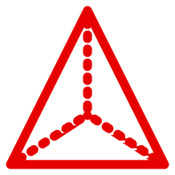

<h1 align = "center">

</h1> 

# Prism
Prism is a programming language created by Parth Pandey in January 2024 designed partially to make it easy to do math, as all parts of computing use math.

Prism provides:
- support for easy, yet complex, mathematical computations
- a nice Julia-based plotting library

(Logo gotten from [here](https://www.svgrepo.com/svg/382617/3d-shape-3d-triangle-shape-geometric-prism-pyramid-shape))

# Download and configure
Download options are not ready yet. Please wait!

This should get Prism ready.

# Info:
Other READMEs: 

[The interpreter](https://github.com/parth-pandey2030/prism/blob/main/interpreter/README.md) 

[The library for some programs used](https://github.com/parth-pandey2030/prism/blob/main/lib/README.md)

[The configuring scripts](https://github.com/parth-pandey2030/prism/blob/main/shell/README.md)

[External modules for Prism code that you can import](https://github.com/parth-pandey2030/prism/blob/main/modules/README.md)

[The visualization module for Prism](https://github.com/parth-pandey2030/prism/blob/main/modules/golden/README.md)

[The module for working with the system (like C) in Prism](https://github.com/parth-pandey2030/prism/blob/main/modules/system/README.md)

